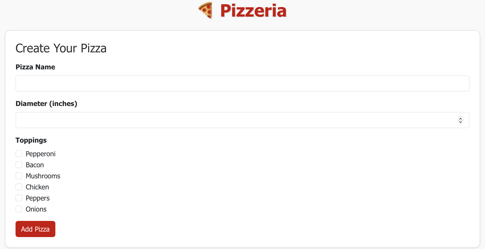
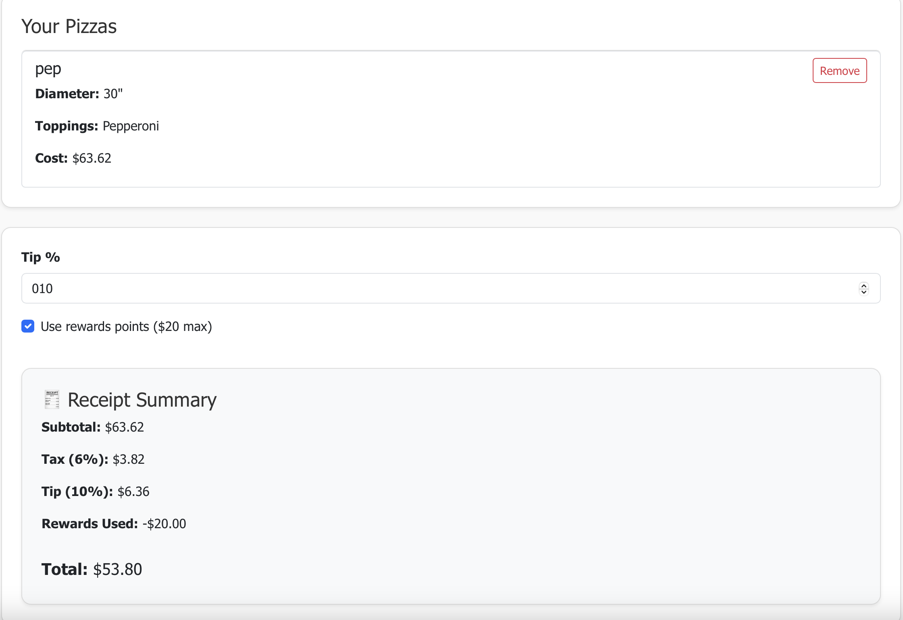

# 🍕 Pizzeria React App

Welcome to the **Adkins Pizzeria React App**, a dynamic and user-friendly pizza ordering simulator! Built with React and styled using Bootstrap, this app allows users to build custom pizzas, manage their order, and see a live-updating receipt with tax, tip, and optional rewards points.

Adapted from the original Java Pizzeria code in my GitHub repo below:
📁 **GitHub Repo:** [https://github.com/TrishaAndres/java-pizzeria](https://github.com/TrishaAndres/java-pizzeria)

---

## 📸 Screenshots




---

## 🚀 Live Demo

You can view the deployed app here: [https://pizzeriatrisha.netlify.app](https://pizzeriatrisha.netlify.app)

---

## ✨ Features

- 🍕 Create custom pizzas (size, name, and up to 6 toppings)
- 🧾 Automatically calculates total cost, tax, tip, and final price
- 🎁 Optional rewards point system that deducts up to $20
- 🗑️ Delete pizzas from your order
- 💰 Real-time price updates based on user input

---

## 🧱 Built With

- [React](https://reactjs.org/)
- [Bootstrap 5](https://getbootstrap.com/)
- CSS for layout and custom styling

---

## 📦 Installation & Setup

```bash
# Clone the repository
git clone https://github.com/TrishaAndres/pizzeria-react.git
cd pizzeria-react

# Install dependencies
npm install

# Run locally
npm start
```

